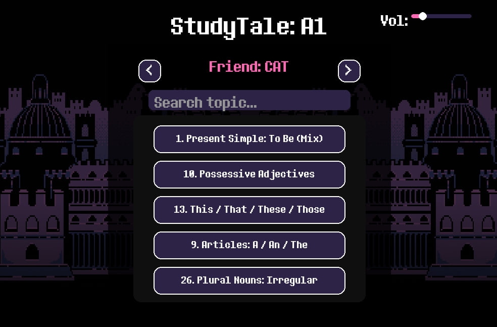
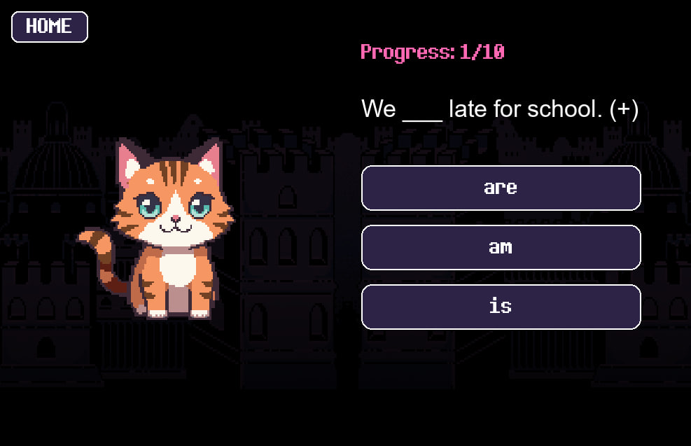
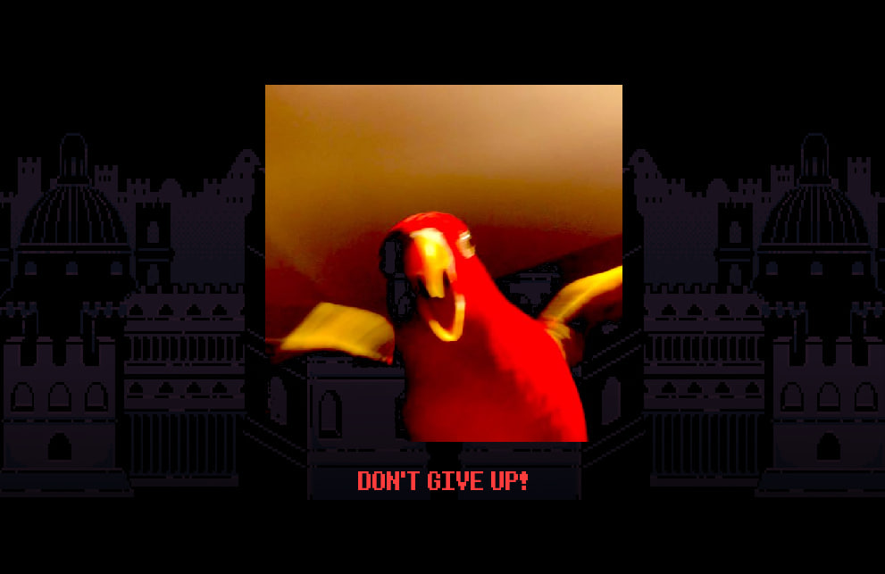

# 🎮 StudyTale: Gamified English Learning App 🐍

StudyTale is an interactive English learning application built with Python and Pygame. It combines professional English teaching methodology (CEFR levels A0-B2) with gamified elements inspired by the iconic aesthetic of *Undertale*.

## 🌟 Features

- **CEFR Level System:** Structured curriculum ranging from Starter (A0) to Upper-Intermediate (B2).
- **Data-Driven Architecture:** All questions and topics are stored in external JSON modules. The app features dynamic data deserialization based on the selected proficiency level.
- **Real-time Search & Navigation:** Integrated search bar for topics and a custom scrolling system to handle large datasets efficiently.
- **Interactive NPC Helpers:** Pixel-art characters that react to the student's progress with unique animations and feedback.
- **Atmospheric Experience:** Dynamic volume control and immersive background music to enhance the learning flow.

---

## 📸 Screenshots

| Start Screen | Level & Topic Selection |
|:---:|:---:|
|  |  |

| Gameplay (Exercise) | Feedback System |
|:---:|:---:|
|  |  |

---

## 🛠 Tech Stack

*   **Language:** Python 3.10+
*   **Engine:** [Pygame](https://www.pygame.org) (Graphics, Audio, Event Loop)
*   **Data Serialization:** JSON (External modular database)
*   **Design Pattern:** Finite State Machine (managing transitions between Start -> Level -> Menu -> Game)

---

## 🚀 Engineering Highlights

During development, I focused on several key software engineering challenges:
1.  **Separation of Concerns:** The application logic is entirely decoupled from the educational content. This allows for easy scaling of the question database without touching the source code.
2.  **Custom GUI Engine:** Developed custom UI components (buttons, sliders, input fields, and scrollable containers) from scratch using Pygame primitives.
3.  **Smart Text Rendering:** Implemented a word-wrap algorithm to handle multi-line rendering for long complex sentences, ensuring consistent UI layout across different screen resolutions.
4.  **State Management:** Built a robust state-switching system to manage complex user flows and data persistence during sessions.
